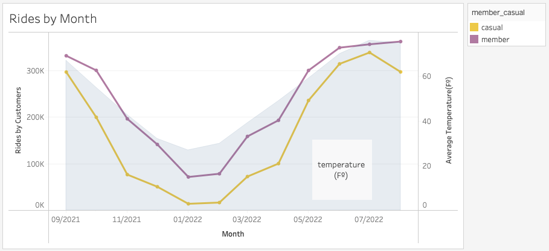
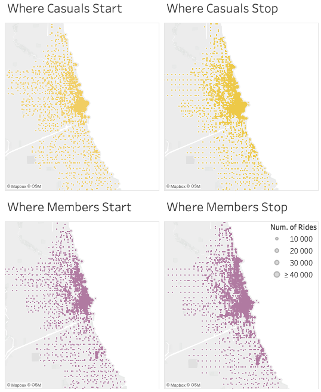
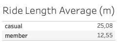
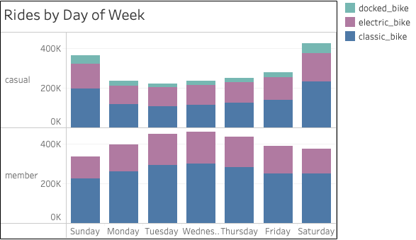
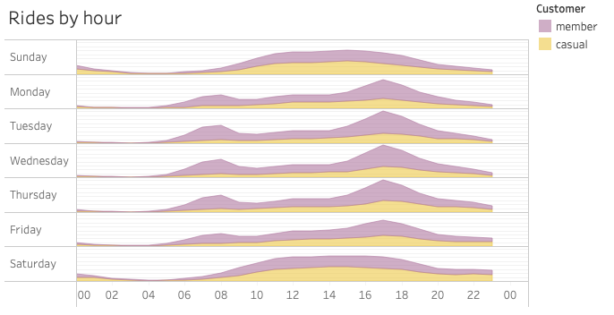

# Bike-Share Company Analysis

---------------------------
Introduction
---------------------------

Bike sharing systems are new generation of traditional bike rentals where whole process from membership,  
rental and return back has become automatic. 
The Cyclistic, a fictional bike-share company, have a program with three diferents plans:  
single-ride passes, full-day passes, and annual memberships.  

 - Customers who purchase single-ride or full-day passes are referred to as **casual riders**.  
 - Customers who purchase annual memberships are **Cyclistic members**.  

Previous analysis concluded that annual members are much more profitable than casual riders and  
the director of Marketing believes that maximizing the number of annual members will be key to future growth.  
Design marketing strategies aimed at converting casual riders into annual members.

---------------------------
Business Task
---------------------------

Analyze and define customer experience for Cyclistic Program

 - How members and casual users differ

 - What the best approach to convert casual users into Cyclistic members

---------------------------
Data Source
---------------------------

The Data used for this analysis is from Lyft Bikes and Scooters, LLC (“Bikeshare”) operates the City of Chicago’s (“City”)  
Divvy bicycle sharing service, from the period of August 2020 to July 2021, available to the public, subject to the terms  
and conditions of this [License Agreement](ride.divvybikes.com/data-license-agreement) and will be used to explore how different customer types are using Cyclistic bikes.  
Following data-privacy, all riders’ personally identifiable information will be excluded from the analysis process. 

The Data was cleaned using python and all the process is registered in the file: [Data Cleaning Process](data_cleaning.ipynb)

---------------------------
Conclusion
---------------------------

### Our Clients Profile

#### Casual Riders

 - Do Longer Rides
 - Responsible for 40% of our Rides in the Past 12 Months
 - Strong Usage on Weekend
 - The only who uses Docked Bike
 - Usage Frequency is smoothly all day 

#### Casual Riders

 - Do Shorter Rides
 - Responsible for 60% of our Rides in the Past 12 Months
 - Strong Usage on Weekday, best on Wednesday
 - Don´t use Docked Bike
 - Usage Frequency is concentrated at rush hours, on weekdays, and all day long on weekends 

### What the best approach to convert casual users into Cyclistic members?

 - We can not securely commit any action based in an analysis using just the current dataset, more data is needed.  

Without distinguish the person on each ride, the analysis have a high chance to perform bias conclusion.  
There´s a lot of behavioural pattern on each customers type, but giving a conclusion based on this can lead us to fail.  
The right choice here is to postpone the action until enough data be collected.

## Executable Plan

 - Use personal ID to distinguish riders, having a better identification of customers behavior and the type of client's group(tourist, resident, seasonal client etc.)
 - Survey to understand client profile (student, worker etc.)

---------------------------
Analysis
---------------------------
(All the visuals was made using Tableau)  
The Graph below shows the count of rides by each type of member in the past 12 months,  
The curve is a bit less drastic within member users usage than the casuals ones and there's a great correlation between the  
bike usages and the seasons of the year,   
The blue section on the graphs shows the average temperature in Chicago.  
  

The Stations are used almost in the same way by all customer's type,  
They use to start their ride more in the center of city,  
Then spread by the center surroundings to end their rides.    

  
Average Rides length differs from each type of customers,  
Cyclistic members apparently do short rides,  
The average is lower than casual riders, who may prefer to do longer rides.

The graph suggests that clients have differents preferences on the weekday usage,  
On the member choices the week days fits best to them, wednesday is the highest peak,  
Then there's some reduction on weekend, where our casual riders shows up to surpass the members in terms of rides.  
The Electric and Classic Bike have almost the same proportion in each week day,  
But appears that the docked byke is not a option for the members in any day.

  
  
Generalizing the hours of rides started in each hour by weekday,  
The casual riders have the usage spreaded smoothly all day long,  
While our members shows a good concentration on their started rides at rush hour (08h and 17h) on weekday,  
But seems they have similar conduct as the casual on weekend.

