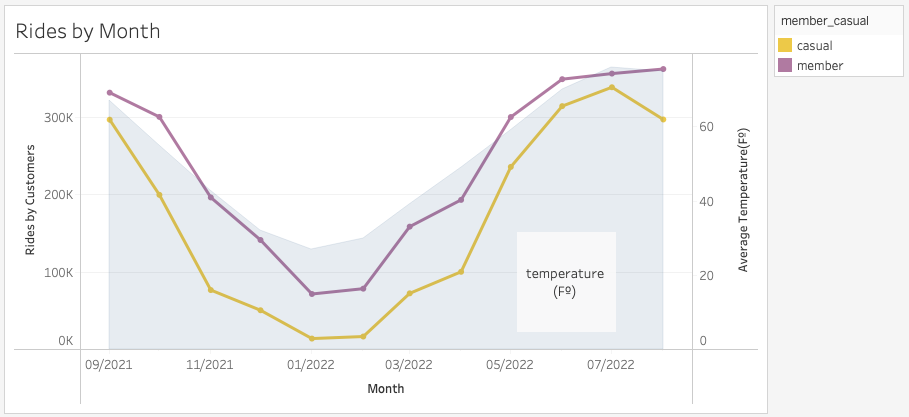

# Data_Analytics_Projects

Bike-Share Company Analysis

---------------------------
Introduction
---------------------------

Bike sharing systems are new generation of traditional bike rentals where whole process from membership,rental and return back has become automatic. 
The Cyclistic, a fictional bike-share company, have a program with three diferents plans: single-ride passes, full-day passes, and annual memberships.  

 - Customers who purchase single-ride or full-day passes are referred to as **casual riders**.  
 - Customers who purchase annual memberships are **Cyclistic members**.  

Previous analysis concluded that annual members are much more profitable than casual riders and the director of Marketing believes that maximizing the
number of annual members will be key to future growth. Design marketing strategies aimed at converting casual riders into annual members.

---------------------------
Business Task
---------------------------

Analyze and define customer experience for Cyclistic Program

 - How members and casual users differ

 - What the best approach to convert casual users into Cyclistic members

---------------------------
Data Source
---------------------------

The Data used for this analysis is from Lyft Bikes and Scooters, LLC (“Bikeshare”) operates the City of Chicago’s (“City”) Divvy bicycle sharing 
service, from the period of August 2020 to July 2021, available to the public, subject to the terms and conditions of this [License Agreement](ride.divvybikes.com/data-license-agreement)
and will be used to explore how different customer types are using Cyclistic bikes. Following data-privacy, all riders’ personally identifiable information 
will be excluded from the analysis process. 

The Data was cleaned using python and all the process is registered in the file Data_Analysis_Process.ipynb

https://github.com/JCadorin/Data_Analytics_Projects/blob/e352b3bc133c5cb320f458e82018eccea2a5d94d/rides_by_month.png
